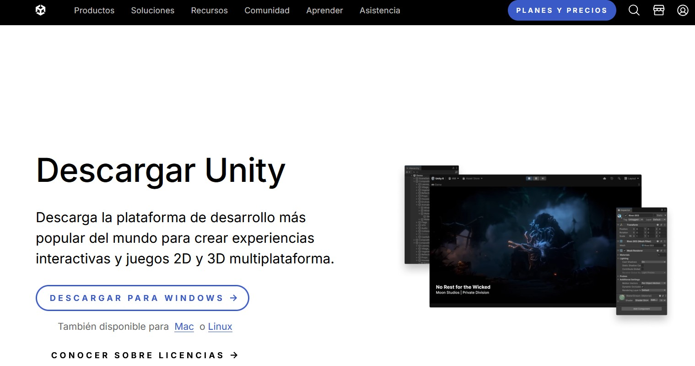
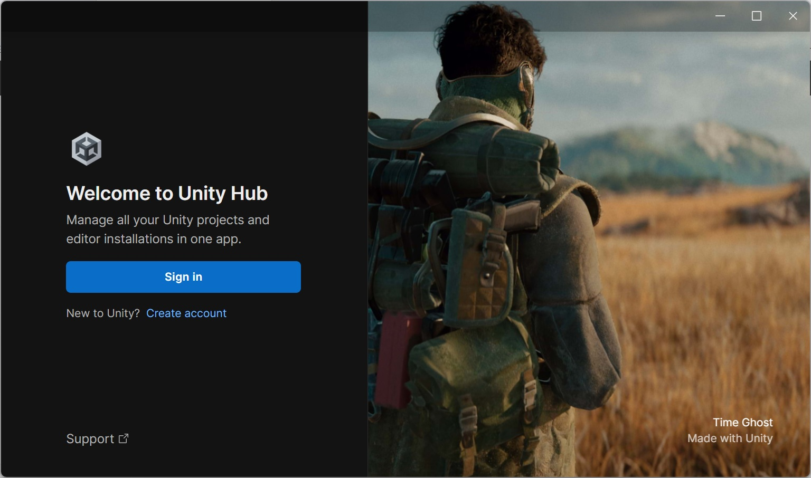
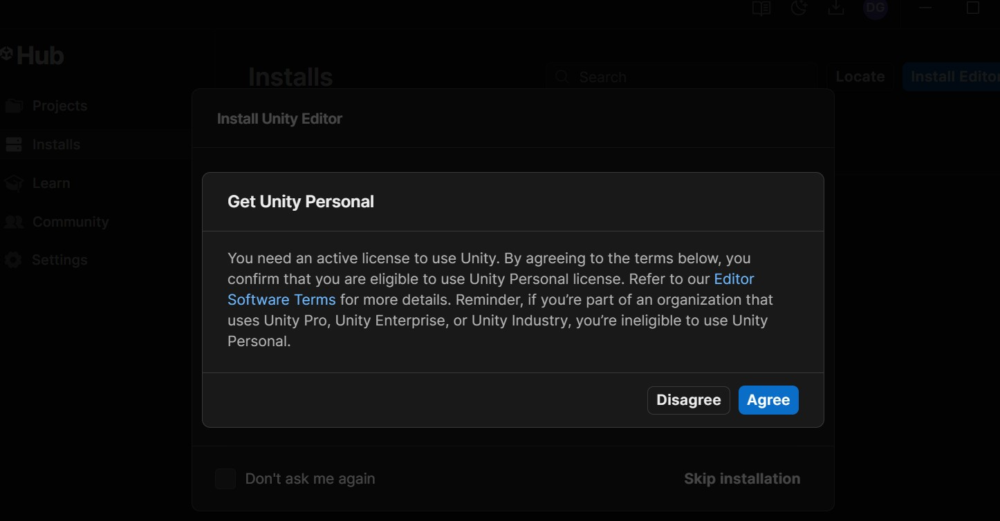
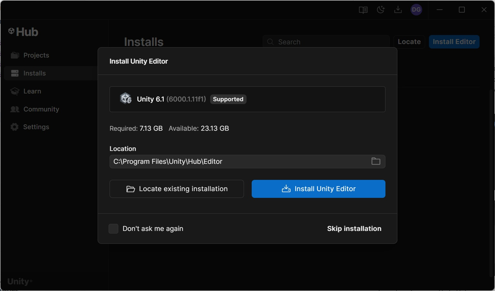
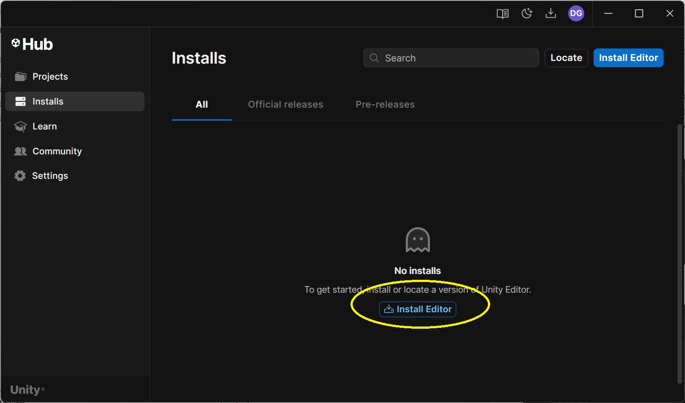
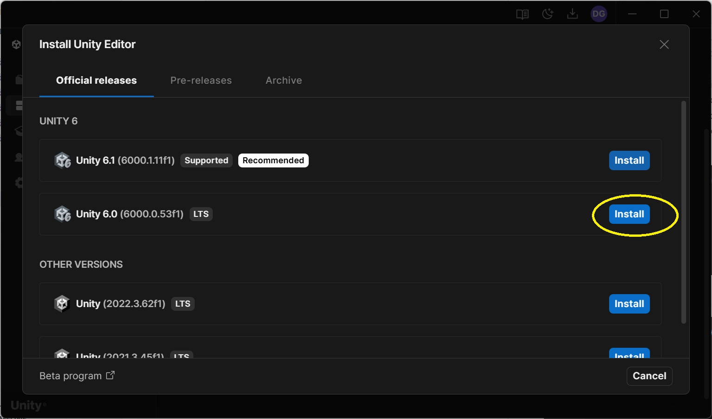
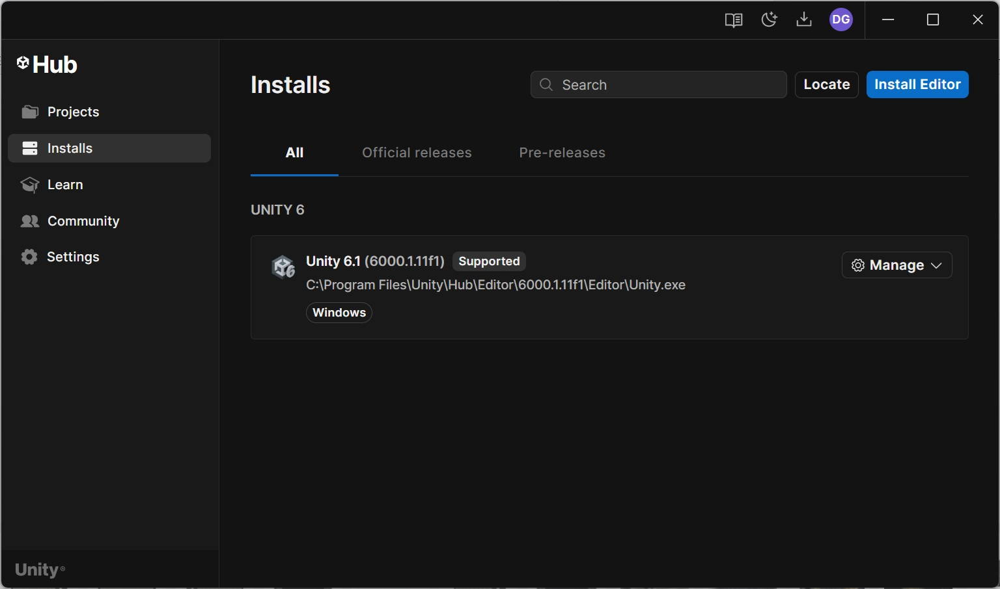

# Tema 0. Introducción a los videojuegos 

1. [*Qué son los videojuegos*](#_apartado1)
   
2. [*Glosario de Términos.*](#_apartado2)
   
3. [*Fases de un videjuego*](#_apartado3)
   
4. [*Fases de producción de un videojuego.*](#_apartado4)
   
5. [*Game Engines (Motores de juegos)*](#_apartado5)
   
6. [*Instalación de Unity* ](#_apartado6)
   

# 1. Qué son los videojuegos

Podemos definir de forma muy genérica un **videojuego** como una “película de animación interactiva” que se modifica por la acción de una o más personas. 

Por lo tanto, vamos a necesitar un dispositivo que muestre las imágenes y algún tipo de controlador que permita la interacción del usuario. 

Además de la imagen y la interacción, otro de los elementos clave en los videojuegos es el **sonido**. 

También podemos utilizar periféricos que transmitan sensaciones al usuario (vibraciones, fuerzas…). 

Los videojuegos producen la sensación de movimiento gracias a la generación de muchos **fotogramas por segundo** (fps). 

Para que la sensación de movimiento sea lo más fluida posible, es necesario generar muchos fotogramas por segundo; normalmente se consideran aceptables unos 30 fps (frames por segundo) aunque los 60fps sería una cifra óptima. 

# 2. Glosario de términos

En el mundo de los videojuegos se utiliza un conjunto de términos y palabras muy específico y que no vendría mal que viésemos, aunque sea de forma muy sencilla. 

- **Sistema de juego** 

Un **sistema de juego** es una regla o conjunto de reglas cuyo objetivo consiste en obtener una serie de resultados coherentes en el seno de un juego. 

- **Gameplay (Jugabilidad)** 

El **Gameplay** es el conjunto de acciones a las que tiene acceso el jugador, gobernado por las interacciones de uno o más **sistemas de juego**. 

- **HUD (Head-Up Display)** 

Se llama **HUD** a la información que se muestra en pantalla durante el juego, generalmente en forma de iconos y textos. El HUD suele mostrar información al usuario como el número de vidas, los puntos, el nivel de salud, minimapas... 

- **Assets (Recursos)** 

Los **assets** son todos los elementos que componen un juego (modelos, texturas, scripts, sonidos, animaciones…) 

- **Frame** 

Cada una de las imágenes estáticas que forman parte de la sucesión de imágenes que componen una animación, y que producen sensación de movimiento. 

- **Textura** 

Imagen en dos dimensiones (bitmap o mapa de bits) que se puede utilizar para aplicar sobre un objeto en tres dimensiones cubriéndolo y simulando una superficie (madera, piedra,  metal,  etc),  como  elemento  gráfico  en  el  HUD  o  como  una  animación  de personajes en un juego 2D. 

- **Frame rate** 

Frecuencia con la que  un juego muestra sucesivas imágenes o  cuadros en pantalla. Generalmente se mide en FPS (Frames per Second o Cuadros por segundo). A mayor frame rate, mayor fluidez y suavidad se aprecia en el movimiento. 

En videojuegos se considera aceptable un frame rate de entre 30-60 FPS siendo ésta última considerada una medida óptima, aunque ciertos juegos pueden superar con el hardware adecuado los 100 FPS. 

- **First Person Game (Juego en Primera Persona)** 

Tipo de juego (normalmente de disparos o shooter) donde la perspectiva con la que jugamos es desde el punto de vista del propio personaje que controlamos. Normalmente sólo vemos el arma y/o el brazo del personaje. 

- **Third Person Game (Juego en Tercera Persona)** 

En este caso la vista con la que jugamos es desde detrás del personaje, con un encuadre de la cámara que permite verlo completamente (o casi). 

- **Power-up (Potenciador)** 

Objeto  que  otorga  al  jugador  una  característica  o  capacidad  especial,  como invencibilidad, mayor velocidad, mayor poder de ataque, etc. 

En esta página tenéis un listado casi interminable de términos relacionados con los videojuegos: 

[http://www.gamerdic.es/ ](http://www.gamerdic.es/)

# 3. Fases de un videojuego

Podemos  estructurar  el  funcionamiento  de  cualquier  videojuego  en  tres  partes secuenciales y bien diferenciadas: 

- **Inicialización** 

La fase de inicialización en memoria incluye la carga de librerías, scripts, objetos y colecciones dinámicas, la declaración de variables, la asignación de valores iniciales, etc… 

También se suele hacer una precarga de recursos para poder utilizarlos más rápidamente, como por ejemplo imágenes, modelos, fuentes o sonidos… 

La clave para optimizar el juego consiste en precargar solamente lo necesario en cada momento. Esto se puede hacer gracias a que los juegos se organizan internamente en pantallas o escenas. 

Con  todo  lo  necesario  en  la  memoria  pasamos  a  crear  el  espacio  de  juego  y,  a continuación, cargamos los componentes y objetos asignándoles las posiciones y valores iniciales relativos al espacio, ya sea en 2D o en 3D. 

- **Bucle de juego**  

Esta parte es la más importante ya que controla los procesos fundamentales de la lógica del juego y el renderizado (o dibujo), creando la ilusión óptica que nos permite percibir el espacio como algo real y con el que podemos interactuar. 

Durante la lógica del juego **se capturan los eventos del teclado**, del ratón, se redefinen las **propiedades de los objetos** (como su posición en el espacio, su velocidad o su apariencia), se comprueba si hay **colisiones** entre objetos, se cambian sus estados y un largo etcétera. 

Una vez hemos analizado la lógica y sabemos qué debe hacer cada componente y objeto del  escenario,  podemos  proceder  a  su  renderizado.  El  resultado  del  proceso  de renderizado será un fotograma o frame. 

Este proceso de análisis de la lógica del juego y posterior renderizado de la escena, se ha de repetir muchas veces por segundo, por eso esta parte se la conoce como bucle de juego. 

- **Liberación** 

Por último, pero no por ello menos importante, cuando decidimos que el juego debe finalizar es fundamental realizar las tareas de limpieza de la memoria y liberación de todos los datos almacenados. 

# 4. Fases de producción de un videojuego

**Fase 1: Concepto** 

Igual que ocurre con la mayoría de los proyectos, los videojuegos comienzan con una **primera idea** a partir de la cual se determinan aspectos fundamentales como el género, el gameplay, el estilo de los personajes, el ambiente, la música… 

Este Concepto normalmente se plasma en un sencillo **guión gráfico (storyboard)** con todas las ideas que suelen pasar por varios procesos de adaptación. 

Con el Concept decidido, podemos pasar a definir los **elementos** que componen el juego. Desarrollamos  la historia, creamos  versiones iniciales de guiones  con los  objetivos, decidimos los personajes principales, etc. 

Utilizando estos esbozos de guiones, los artistas se ponen manos a la obra para crear **diseños previos del aspecto del juego**, la forma en que se visualizarán los personajes, los escenarios, objetos, etc. Su trabajo es presentar propuestas visuales para ir dando forma a la idea original. 

También se describen los elementos sonoros de los que consta el juego: efectos de sonido, ambientación, música, voces... 

Paralelamente se especifica el funcionamiento general del videojuego. 

Finalmente se hace el diseño de la programación, que describe la manera en la que se implementará el videojuego, el lenguaje o lenguajes de programación que se utilizarán, las metodologías que se seguirán, etc. 

**Fase 2. Preproducción** 

Se realiza una planificación de todas las tareas, con el reparto del trabajo, los plazos de entrega, las reuniones de seguimiento... 

Todo lo anterior tiene como objetivo generar el Documento de Diseño del Juego o **GDD** (Game  Design  Document)  que  especificará  el  desarrollo  del  arte,  las  mecánicas,  la programación del videojuego y la planificación. 

Si es posible, se realiza un prototipo muy sencillo del videojuego. 

Una vez tenemos claro lo que hay que hacer, cómo hacerlo y se ha planificado el tiempo, empezamos la producción con el objetivo de crear el juego, como mínimo en una versión inicial que se mejorará gradualmente. 

Lo primero que hemos de hacer es generar todos los assets del juego teniendo como guía el  GDD:  programación,  texturas,  desarrollo  de  interfaces,  animación,  modelado, desarrollo de sonidos, etc. 

**Fase 3. Producción** 

Con todos los assets preparados (o la mayoría) pasamos a “ensamblar” o editar el juego. Aquí es donde utilizamos los motores de juegos (**game engines) como Unity o Unreal**. Si logramos ensamblar correctamente todos los assets, esta fase termina (por ahora). Sin embargo, al igual que en el desarrollo de software tradicional, es muy difícil que todo salga bien a la primera, por lo que se entra en una fase para probar a fondo el videojuego. 

**Fase 4. Pruebas**  

En esta fase se corrigen los errores del proceso de edición inicial y se mejora la jugabilidad a medida que se prueba el juego. 

Generalmente encontraremos dos tipos: **las pruebas alpha**, realizadas por un pequeño grupo de personas, generalmente involucradas en el desarrollo, y  **las pruebas beta**, realizadas por un equipo externo de jugadores. Las primeras tienen el objetivo de corregir defectos graves y mejorar características fundamentales no contempladas en el GDD, mientras que las segundas se enfocan en la detección de fallos menores y en perfilar la experiencia de usuario. 

**Fase 5. Post Producción.** 

Durante esta fase nos encargamos del **márketing, distribución y mantenimiento**. 

La distribución consiste en crear copias del juego terminado y llevarlo a las tiendas (ya sean físicas o digitales) para su venta (aunque sean gratuitos). 

El proceso de márketing es fundamental para dar a conocer el videojuego y conseguir el mayor número de jugadores posibles. 

Las tareas de márketing no tienen un orden concreto dentro del desarrollo, pero es habitual hacer campaña de un videojuego mucho tiempo antes de publicarlo. 

Tanto la distribución como el márketing suelen delegarse en empresas externas. 

Aunque el juego ya esté distribuido, su ciclo de vida todavía no ha terminado. La fase de mantenimiento es el momento de arreglar nuevos errores, mejorarlo, etc. Esto se hace sacando parches o actualizaciones nuevas al mercado. 

El mantenimiento del videojuego es también una magnífica oportunidad para seguir sacándole partido. 

Ya sea en forma de microtransacciones, suscripciones de pago o incluso con expansiones completas que añaden nuevas características al videojuego sin modificar en profundidad el motor de este, mediante las tareas de mantenimiento se puede aprovechar al máximo la base inicial del videojuego. 

[Fases de desarrollo de un videojuego](https://thegoodgamer.es/desarrollo-de-un-videojuego-en-que-etapas-se-divide/)

# 5. Game Engines (Motores de juegos)

Existen multitud de **bibliotecas** y de **motores** que se pueden utilizar para crear juegos.  

Por lo general, se tiende a usar la palabra “**biblioteca**” cuando sólo proporciona soporte para tareas muy básicas, como mostrar imágenes, reproducir sonidos o comprobar el estado del teclado y otros dispositivos de entrada.  

Ejemplos de bibliotecas: SDL, Allegro, XNA, OpenGL, Kivy… 

Un **Game Engine** (motor de juego) nos debe facilitar el desarrollo de videojuegos para múltiples plataformas, de forma que nos permita reducir tanto los costes como los tiempos de desarrollo. 

Por  esto,  es  interesante  que  al  **elegir  un  Game  Engine**,  le  pidamos  una  serie  de características: 

- **Editor  potente**:  creación  de  escenas  3D,  importación  de  assets  en  diferentes formatos, editor de scripts, creación de animaciones, desarrollo en 2D y 3D, editor de GUI, previsualización del juego, gestión de sonidos... 

- **Motor de físicas** (en 2D y 3D) y renderizado avanzados. 
- **Motor de scripts** eficiente. 
- Distribución **multiplataforma**. 
- Generador de **sistemas de partículas**. 
- Editor de **terrenos**. 
- **Documentación** lo más completa posible. 
- Coste reducido. 
- Curva de aprendizaje corta. 

## Motores de juegos

- **Unity3D** es un motor de juegos multiplataforma 3D y 2D, propietario, creado en C++ pero que usa C# como lenguaje de script. Su origen es del año 2005 y se permite su uso libre para usuarios/empresas que generen menos de 100.000 dólares al año, debiéndose  pagar  a  partir  de  ese  punto.  **Será  la  herramienta  en  la  que  nos centraremos**. 
  
- **Unreal Engine** es un motor de juegos creado inicialmente por Epic Games para el juego FPS Unreal (1998) y evolucionado posteriormente. Está creado en C++ y orientado sobre todo a la creación de juegos 3D, aunque también se puede emplear para 2D y, por supuesto, para otras temáticas de juego distinto de los “shooters” en primera persona. Permite generar ejecutables para multitud de plataformas. Su código libre es descargable y su modelo de negocio se basa en royalties generados por los programas que se creen usándolo. 
  
- **Godot Engine** es un motor de juegos multiplataforma 3D y 2D, de código abierto, creado en C++ pero que usa su propio lenguaje (GDScript) o bien, opcionalmente, C#. Incluye su propio entorno de desarrollo. 
  
- **idTech** es el nombre genérico que se da a una serie de motores creados por idSoftware para sus juegos Doom, Quake y secuelas posteriores. Las primeras versiones de estos motores son de códigoabierto (y se pueden descargar desde la cuenta de GitHub de idSoftware), pero las más recientes no. 
  
- **Panda3D** es un motor de código abierto, creado por Disney y la Carnegie Mellon University, desarrollado en C++ pero que usa Python como lenguaje de script. En general, resulta mucho menos amigable que otros como Unity. 
  
- **Construct** permite crear juegos en HTML5 (lo que supone que también se pueden convertir a “aplicaciones híbridas” para hacerlos funcionar en Android e iOS, o incluso en escritorio), y usa una aproximación  “visual”, que permite indicar los eventos a los que deberesponder el programa, en vez de teclear órdenes. La primera versión era de código abierto, pero la actual es comercial. 

## ¿Por qué Unity? 

- Porque cumple gran parte de las exigencias que hemos comentado. 
  
- Es el motor con mayor número de usuarios y juegos actualmente.
   
- La  versión  básica  es  gratuita  y  nos  permite  desarrollar  juegos  para  múltiples plataformas: PC, Linux, Mac, iOS, Android, WebGL, Web o BlackBerry. 
  
- El editor está disponible para Windows y para Mac. 
  
- Su entorno gráfico y de desarrollo es muy potente. 
  
- Cuenta con una Asset Store con gran cantidad de complementos. 
  
# 6. Instalación de Unity

Vamos a ver los pasos necesarios para instalar Unity en nuestro ordenador. 

Primero iremos a la página oficial de Unity:[ https://unity.com/es ](https://unity.com/es)donde tendremos una página similar a esta: 

Pulsaremos el botón **Descargar** y nos aparecerá la página, donde podremos elegir un plan o directamente descargar el instalador de Unity Hub: 

En  este  punto  se  nos  descargará  el  **instalador  de  Unity  Hub**,  que  nos  hará  de “concentrador” de nuestros proyectos de Unity y nos permitirá tener instaladas varias versiones del editor de Unity a la vez. 

Al  instalar  el  Unity  Hub,  lo  ejecutaremos  y  nos  aparecerá  esta  pantalla  en  la  que deberemos iniciar sesión, o como en vuestro caso, tendréis que crear una cuenta y daros de alta como usuario en Unity (créate account). 

Además, para poder instalar un editor de Unity necesitaremos tener una licencia. 

[En este vídeo ](https://www.youtube.com/watch?v=VZ25jjf7fQU)se explica perfectamente el proceso para crear un usuario y una licencia. A partir de ese momento podremos instalar una o varias versiones de Unity. 

Una vez creada y habiendo iniciado sesión y teniendo la licencia, nos ofrece la opción de instalar una versión de Unity o si saltamos ese paso podemos ir a la opción Installs en la que podemos instalar (ya que no tenemos instalada ninguna versión del editor de Unity) la última versión LTS (con soporte de larga duración). 

o bien:

Cuando entremos a Unity Hub nos aparecerá esta pantalla: 

en la que aparecen los distintos editores de Unity Hub instalados (puedo tener varios) y los proyectos que iremos creando. 

En el próximo tema crearemos un nuevo proyecto y empezaremos a explorar el entorno de desarrollo. 

